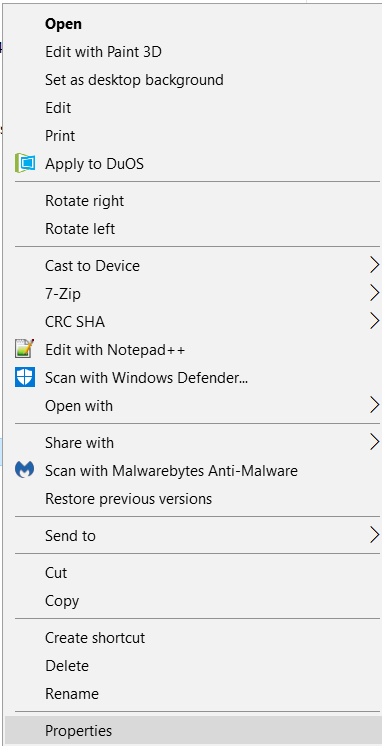
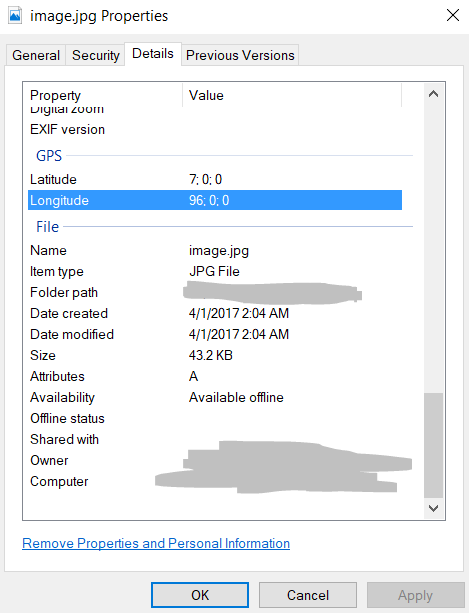

#Meta Find Me 

To find the flag, open the image in a text editor and search for "flag". This yields
`Your flag is flag_2_meta_4_me_<lat>_<lon>_1c1f`. To find the latitude and longitude, the easiest solution is to right click the image in Windows, then navigate to properties>details.

Simply replace the <lat> and <lon> with the corresponding numbers and there's the flag!
Oddly enough, I spent most of my time figuring out that the flag wasn't in the form of <96>, it was just the 96 itself.

