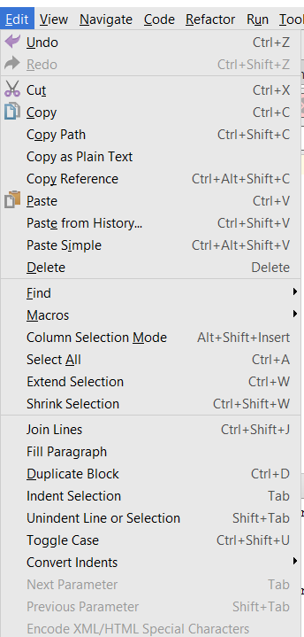

#WorldChat

To filter WorldChat, connect to it with NetCat instead of a program like PuTTY, then grep for flag.
``$ nc shell2017.picoctf.com 44323 | grep -i flag`

Eventually, lines similar to  
`flagperson: this is part 3/8 of the flag - 26c1` will appear. So, the next step is to filter by "flagperson"
```
$ nc shell2017.picoctf.com 44323 | grep -i flagperson
01:44:42 flagperson: this is part 1/8 of the flag - 7c20
01:44:49 flagperson: this is part 2/8 of the flag - 77dc
01:44:50 flagperson: this is part 3/8 of the flag - 26c1
01:44:53 flagperson: this is part 4/8 of the flag - 6dc8
01:45:04 flagperson: this is part 5/8 of the flag - 1acd
01:45:07 flagperson: this is part 6/8 of the flag - e49c
01:45:08 flagperson: this is part 7/8 of the flag - d563
01:45:09 flagperson: this is part 8/8 of the flag - 0146
```

so to extract the flag, one could transcribe it, manually copy and paste each portion, or could use a code editor to rectangular select and delete the right parts. My editor of choice is Jetbrains Pycharm




Alternatively, Notepad++ works, simply hold the ALT button in order to enter column editing mode, then use the same regex replacement of new line to find the flag
`7c2077dc26c16dc81acde49cd5630146`